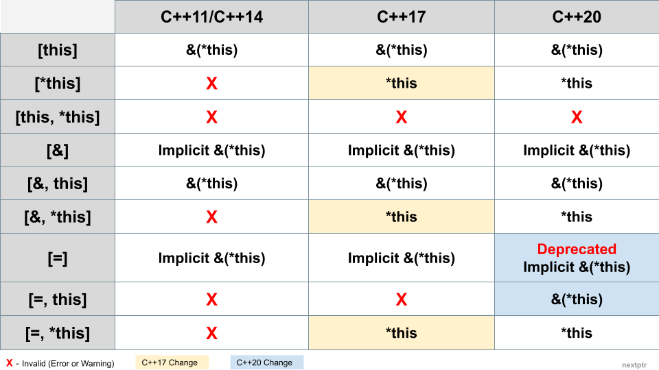

# 목적
* 람다를 '어떻게' 쓰는지 에 대해 설명합니다.
* 람다가 '뭔지', '어디에' 쓰는지에 대해 설명하지 않습니다.
  * 스스로 찾아보도록 합시다.
  * 나도 모름 ¯\\_( ͡° ͜ʖ ͡°)_/¯

----

# C++ 에서 Lambda syntax

```
[=] ( ) mutable ->int { ... }
——— ——— ——————— ————— ———————
 1   2     3      4      5
```

1. Capture
2. Parameter 목록 (Optional?)
3. Mutable specifier (Optional)
4. Return type (Optional)
5. 람다 본문

[comment]: <> (
    Parameter 목록은 Optional 한 구문이지만, 적어주는게 좋다.
    std::cout<<[]{return 10; }\(\);   // OK
    std::cout<<[]\(\){return 10; }\(\); // OK
    Return type 이 명시되는 경우, Paramter 가 없더라도 Parameter 구문을 표기해 줘야 하기 때문이다. 습관처럼 쓰는게 좋음
    std::cout<<[]\(\)->int{return 10; }\(\); // OK
    std::cout<<[]->int{return 10; }\(\);   // ERROR
)

----

## E~~~asy Example

```c++
void main() {
    int a = 1;
    auto add = [=](int b)->int{ return a+b; };
    std::cout<<"1+2:"<<add(2);
}
```

출력

```
1+2:3
```

----

# Capture

* **[&]** : lambda 함수 외부 변수를 참조로 가져옴 (call-by-ref)
* **[=]** :  lambda 함수 외부 변수를 값으로 가져옴 (call-by-val)
* **[x]** : 변수 x 를 값으로 가져옴
* **[=, &x]** : lambda 함수 외부 변수를 값으로 가져오되, 변수 x 는 참조로 가져옴
* **[x, &y, &z]** : 변수 x 는 값으로, y, z 는 참조로 가져옴

----

# Capture Demo

```c++
    int x(5),y(6),z(7);
    int* p = &z;
    [=, x, &y, p](){
        printf("%d %d %d %d\n", x, y, z, *p);
        // x=15, z=17;  // call-by-val can not modified
        y=16, *p=27;    // p point to z
    }();
    printf("%d %d %d %d\n", x, y, z, *p);
```

출력

```
5 6 7 7
5 16 27 27
```

----

# Capture Quiz

```c++
    int a = 0;
    int* p = &a;
    [=, &p](){
        *p = 1;
        std::cout<<" inside lambda> a:"<<a<<", p:"<<*p<<std::endl;
    }();
    std::cout<<"outside lambda> a:"<<a<<", p:"<<*p<<std::endl;
```

출력

```
 inside lambda> a:?, p:?
outside lambda> a:?, p:?
```

----

# Parameter list

```c++
auto pplus = [](int a, int b){
    printf("%d+%d=%d\n",a, b, a+b);
};

pplus(2, 3);
```

출력
```
2+3=5
```

----

# Mutable specifier

```c++
int a=1, b=2,c=0;
[=](){c=a+b; std::cout<<"c : "<<c<<std::endl;}();
//출력
//> error: cannot assign to a variable captured by copy in a non-mutable lambda
//> [=](){c=a+b; std::cout<<"c : "<<c<<std::endl;}();
//>       ~^
```

```c++
int a=1, b=2,c=0;
[=]() mutable {c=a+b; std::cout<<"c : "<<c<<std::endl;}();
//출력
//> 3
```

----

# Return type

* 💦 Under construct

```c++

```

----

# Lambda body

* 이걸 굳이 설명할 필요가... (￣ ‘i ￣;)


----

# 다음장 부터는 뭘 좋아할지 몰라서 다 준비해본 것들임.
## 두서없음에 주의 💦


----

# (C++ 의) Lambda 란?

* 함수 객체와 동일한 익명함수 이다.
    * 함수 객체 (functor)
      ```c++
        struct Add { int operator()(int a, int b){ return a + b;} };
        Add adder;
        std::cout<<adder(1, 2);
      ```
        * 상태를 갖음
        * class 선언을 해야 함
----

# Functor vs Lambda

```c++
class Add {
    public:
    int operator()(int a, int b) {
        return a + b;
    }
};
std::cout<<Add()(1, 2);
```

**VS**

```c++
std::cout<<[](int a, int b){ return a + b; }(1, 2);
```

---

# this capture

* class member variable 에 접근하기 위해서는 `this` capture 를 사용

```c++
// include string, memory, vector, algorithm

struct Sorted {
    Sorted(std::vector<int> v):v_(v){}
    std::function<int()> get(std::string order) {
        if(order=="asc") return [this](){ std::sort(v_.begin(), v_.end(), std::less<int>()); return v_[0]; };
        return [this](){ std::sort(v_.begin(), v_.end(), std::greater<int>()); return v_[0]; };
    }
    private:
    std::vector<int> v_;
};

int main() {
    Sorted sort({3, 1, 2, 4});
    std::cout<<"smallest : "<<sort.get("asc")()<<std::endl;
    std::cout<<"biggest  : "<<sort.get("dec")()<<std::endl;
}
```

---

## this capture comparison


---

# Lambda 재귀

```c++
std::function<int(int)> f = [&f](int n)->int{ return n<=1 ? 1 : n*f(n-1); };
std::cout<<"factorial(5) => "<<f(5); // 5*4*3*2*1=>120
```

* Lambda 를 재귀로 사용할 경우, 람다 객체 타입이 명시되어야 함
  * `auto` 사용시, capture 시점에 타입이 추론 되지 않기 때문에,
     타입을 명시해야 함.

```c++
// std::functional( return_type <params, ..> ) // Example
std::functional(int<char,float,void*>) fn = [](char a, float b, void* c)->int{
    printf("%c, %f, %p", a, b, c);
};
```

----
# Functional Programming Concept

* 순수 함수 (Pure function)
* 재귀 (Recustion, not loop)
* 참조 투명성 (Referential Transparency)
* **1급 객체 함수**, 고차 함수 (First-class, Higher-order function)
* 불변 변수 (Immutable)

[comment]: <> ( // https://hackr.io/blog/functional-programming
    순수 함수 : 상태를 갖지 않음으로, 입력에 대한 출력이 항상 동일함. 따라서, 디버깅, Concurrent application 작성이 쉬움
    재귀 : for 나 while 같은 loop 가 없음. 따라서 재귀를 통해서 반복된 작업을 수행함.
    참조 투명성 : 한번 정의된 변수는 작업을 수행하는 과정에서 값이 변경되지 않음. 어느 시점에 확인해도 동일한 값이 유지됨
    1급 객체, 고차 함수 : 1급 객체 -> 변수처럼 취급되는 함수. 고차 함수 -> 함수를 파라메터로 받거나, 리턴값으로 반환하는 함수
    불변 변수 : 한번 초기화되면 더이상 수정 불가
)

----
## 1급 객체 (first class citizen) 란?

1. All items can be the actual parameters of functions
2. All items can be returned as results of functions
3. All items can be the subject of assignment statements
4. All items can be tested for equality. (💦)

Note. Primitive 변수는 어떤 언어에서나 1급 객체.

----

## 1급 객체 on C++

```c++
auto plus2factory = [](std::function<int(int)> f)->std::function<int(int)>{
    return [=](int y)->int{ return f(y) + 2; };
};

auto plus1 = [](int x)->int{ return x+1; };
auto plus2 = plus2factory(plus1);
std::cout<<"5+1+2 => "<<plus2(5)<<std::endl;
// 출력
// 5+1+2 => 8
```

---

### C++ 14 이상

* 앞서 예제에서 파라메터와 반환 타입을 `auto` 로 사용 가능

```c++
auto plus2factory = [](auto f)->auto{
    return [=](int y)->int{ return f(y) + 2; };
};

auto plus1 = [](int x)->int{ return x+1; };
auto plus2 = plus2factory(plus1);
std::cout<<"5+1+2 => "<<plus2(5)<<std::endl;
// 출력
// 5+1+2 => 8
```

----

# Closure using Lambda

* 일급 객체 함수(first-class functions)의 개념을 이용하여
  스코프(scope)에 묶인 변수를 바인딩 하기 위한 일종의 기술

```c++
auto startAt = [](int x) { return [x](int y){ return x+y; }; };
auto closure1 = startAt(1);
auto closure2 = startAt(2);

std::cout<<"result of closure start at 2 => "<<closure2(1)<<std::endl;
std::cout<<"result of closure start at 1 => "<<closure1(1)<<std::endl;
```

---


# References

* [MSDN C++의 람다 식](https://docs.microsoft.com/ko-kr/cpp/cpp/lambda-expressions-in-cpp?view=msvc-160)
* [MSDN 람다식의 예](https://docs.microsoft.com/ko-kr/cpp/cpp/examples-of-lambda-expressions?view=msvc-160)
* [First-class citizen](https://en.wikipedia.org/wiki/First-class_citizen)
* [함수형 프로그래밍 요약](https://velog.io/@kyusung/%ED%95%A8%EC%88%98%ED%98%95-%ED%94%84%EB%A1%9C%EA%B7%B8%EB%9E%98%EB%B0%8D-%EC%9A%94%EC%95%BD)
* [Functional Programming: Concepts, ...](https://hackr.io/blog/functional-programming)
* [수까락의 프로그래밍 이야기](http://sweeper.egloos.com/3015035)
* [Lambda Expressions in C++](https://docs.microsoft.com/en-us/previous-versions/visualstudio/visual-studio-2010/dd293608(v=vs.100)?redirectedfrom=MSDN)
* [lambda expression timeline](https://www.nextptr.com/tutorial/ta1430524603/capture-this-in-lambda-expression-timeline-of-change)
* [클로저](https://ko.wikipedia.org/wiki/%ED%81%B4%EB%A1%9C%EC%A0%80_(%EC%BB%B4%ED%93%A8%ED%84%B0_%ED%94%84%EB%A1%9C%EA%B7%B8%EB%9E%98%EB%B0%8D))
